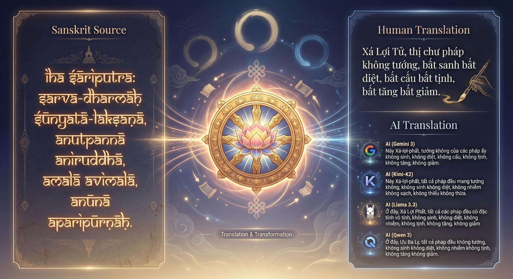
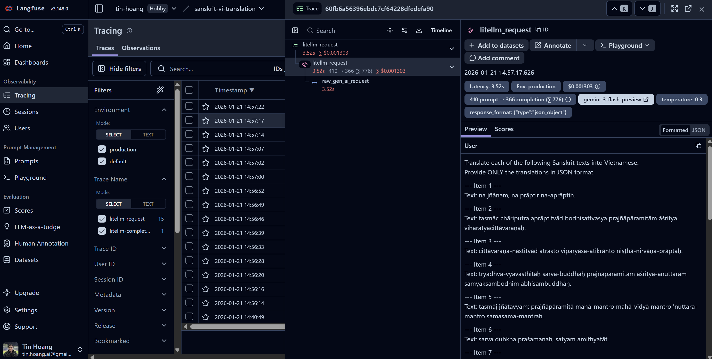
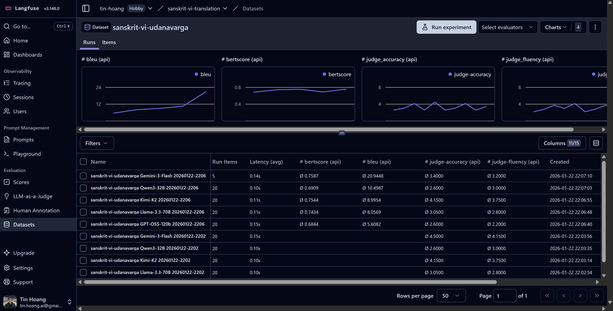

# Buddhist Text Translation Benchmark
This benchmark evaluates how well AI models translate sacred texts from **Sanskrit** and **Pali** into Vietnamese, comparing them against classical translations by renowned Buddhist monks.

<p align="center">
  
</p>

<p align="center">
  
  
  
  
  
</p>

## 🔬 Research Questions

1. Can modern LLMs translate ancient Buddhist scriptures as well as human scholars?
2. Which current LLM achieves the highest translation accuracy?
3. Which is the better source language to translate into Vietnamese: Sanskrit or Pali?

##  Supported Benchmarks

| Task | Description | Source Text |
|------|-------------|-------------|
| `sanskrit-vi` | Sanskrit → Vietnamese (Heart Sutra) | `sanskrit_vi_heart_sutra.csv` |
| `pali-vi` | Pali → Vietnamese (Dhammapada) | `pali_vi_dhammapada.csv` |
| `compare` | Pali vs Sanskrit comparison | `dhammapada_udanavarga_parallel.csv` |


## 📊 Results

### Sanskrit → Vietnamese (Heart Sutra | Bát Nhã Tâm Kinh)

**Date**: 2026-01-24

**LLM Judge Model**: gemini/gemini-3-flash-preview

**Dataset**: data/sanskrit_vi_heart_sutra.csv

| Dataset                 | Model                |   BLEU ↑ |   BERTScore ↑ |   LLM Judge Accuracy (1-5) ↑ |   LLM Judge Fluency (1-5) ↑ |   Time (s) ↓ |
|:------------------------|:---------------------|---------:|--------------:|-----------------------------:|----------------------------:|-------------:|
| sanskrit-vi-heart-sutra | GPT-OSS-20B          |     4.29 |          0.62 |                         2.72 |                        2.11 |         4.36 |
| sanskrit-vi-heart-sutra | GPT-OSS-120b         |     8.52 |          0.71 |                         3.00 |                        2.61 |         9.32 |
| sanskrit-vi-heart-sutra | Llama-3.1-8b         |     6.02 |          0.68 |                         2.39 |                        2.22 |         1.49 |
| sanskrit-vi-heart-sutra | Llama-3.3-70B        |    15.82 |          0.72 |                         4.00 |                        3.61 |         2.89 |
| sanskrit-vi-heart-sutra | Llama-4-Maverick-17B |    21.72 |          0.75 |                         4.67 |                        4.22 |         4.54 |
| sanskrit-vi-heart-sutra | Kimi-K2              |    10.80 |          0.67 |                         4.61 |                        4.00 |         4.03 |
| sanskrit-vi-heart-sutra | Qwen3-32B            |    11.50 |          0.75 |                         3.83 |                        3.33 |         4.76 |
| sanskrit-vi-heart-sutra | GPT-5.2            |    20.79 |          0.75 |                         4.89 |                        4.39 |        17.89 |
| sanskrit-vi-heart-sutra | Gemini-3-Flash       |    33.73 |          0.76 |                         4.94 |                        4.56 |        11.11 |

### Pali → Vietnamese (Dhammapada | Kinh Pháp Cú)

**Date**: 2026-01-24

**LLM Judge Model**: gemini/gemini-3-flash-preview

**Dataset**: data/pali_vi_dhammapada.csv

| Dataset            | Model                |   BLEU ↑ |   BERTScore ↑ |   LLM Judge Accuracy (1-5) ↑ |   LLM Judge Fluency (1-5) ↑ |   Time (s) ↓ |
|:-------------------|:---------------------|---------:|--------------:|-----------------------------:|----------------------------:|-------------:|
| pali-vi-dhammapada | GPT-OSS-20B          |     1.68 |          0.67 |                         1.40 |                        1.55 |         3.57 |
| pali-vi-dhammapada | GPT-OSS-120b         |     5.96 |          0.70 |                         2.45 |                        1.95 |        10.84 |
| pali-vi-dhammapada | Llama-3.1-8b         |     0.84 |          0.66 |                         1.45 |                        1.65 |         1.99 |
| pali-vi-dhammapada | Llama-3.3-70B        |     9.27 |          0.77 |                         3.05 |                        2.75 |         5.13 |
| pali-vi-dhammapada | Llama-4-Maverick-17B |    15.75 |          0.78 |                         4.20 |                        3.90 |         3.06 |
| pali-vi-dhammapada | Kimi-K2              |    15.99 |          0.79 |                         4.30 |                        4.00 |         6.53 |
| pali-vi-dhammapada | Qwen3-32B            |    13.58 |          0.77 |                         3.25 |                        3.05 |         4.71 |
| pali-vi-dhammapada | GPT-5.2              |    21.90 |          0.80 |                         4.70 |                        4.45 |        22.24 |
| pali-vi-dhammapada | Gemini-3-Flash       |    32.67 |          0.83 |                         4.65 |                        4.45 |         8.47 |

### Pali vs Sanskrit Comparison (Dhammapada - Udanavarga | Kinh Pháp Cú)

To analyze the comparative translation quality between Middle Indo-Aryan (Pali) and Old Indo-Aryan (Sanskrit) into Vietnamese, we constructed a multi-source parallel corpus based on the "Gāthā" (verse) literature of early Buddhism.
- Pali Source: The Dhammapada (Theravāda tradition), widely regarded as the most representative anthology of early Buddhist ethics.
- Sanskrit Source: The Udanavarga (Sarvāstivāda tradition), the Sanskrit textual cousin to the Dhammapada.
- Vietnamese References:
  - Reference A (Liturgical): Translations by Thich Minh Chau (strictly adhering to the Pali Prime).
  - Reference B (Modern/Natural): Contemporary prose translations focusing on intelligibility.

**Date**: 2026-01-24

**Judge Model**: gemini/gemini-3-flash-preview

**Dataset**: dhammapada_udanavarga_parallel.csv (20 samples)

| Dataset                     | Model                |   BLEU ↑ |   BERTScore ↑ |   LLM Judge Accuracy (1-5) ↑ |   LLM Judge Fluency (1-5) ↑ |   Time (s) ↓ |
|:----------------------------|:---------------------|---------:|--------------:|-----------------------------:|----------------------------:|-------------:|
| pali-vi-dhammapada-18verses | GPT-OSS-20B          |     1.41 |          0.67 |                         1.72 |                        2.17 |         6.97 |
| pali-vi-dhammapada-18verses | GPT-OSS-120b         |     7.60 |          0.70 |                         2.50 |                        2.28 |        10.20 |
| pali-vi-dhammapada-18verses | Llama-3.1-8b         |     1.59 |          0.71 |                         2.00 |                        2.33 |         1.89 |
| pali-vi-dhammapada-18verses | Llama-3.3-70B        |     9.00 |          0.76 |                         3.72 |                        3.22 |         4.39 |
| pali-vi-dhammapada-18verses | Llama-4-Maverick-17B |    16.60 |          0.80 |                         4.22 |                        3.72 |         2.95 |
| pali-vi-dhammapada-18verses | Kimi-K2              |    11.61 |          0.72 |                         2.88 |                        2.94 |         5.42 |
| pali-vi-dhammapada-18verses | Qwen3-32B            |    12.02 |          0.78 |                         3.17 |                        3.06 |         4.44 |
| pali-vi-dhammapada-18verses | GPT-5.2 |    19.49 |          0.80 |                         4.67 |                        4.44 |        21.71 |
| pali-vi-dhammapada-18verses | Gemini-3-Flash       |    37.58 |          0.84 |                         4.67 |                        4.56 |         6.33 |
| sanskrit-vi-udanavarga-18verses | GPT-OSS-20B          |     1.75 |          0.67 |                         1.61 |                        1.89 |         5.49 |
| sanskrit-vi-udanavarga-18verses | GPT-OSS-120b         |     5.29 |          0.70 |                         2.00 |                        1.89 |         8.32 |
| sanskrit-vi-udanavarga-18verses | Llama-3.1-8b         |     4.18 |          0.72 |                         1.72 |                        2.56 |         1.77 |
| sanskrit-vi-udanavarga-18verses | Llama-3.3-70B        |     8.34 |          0.76 |                         3.06 |                        2.72 |         3.84 |
| sanskrit-vi-udanavarga-18verses | Llama-4-Maverick-17B |    13.24 |          0.78 |                         3.61 |                        3.00 |         2.55 |
| sanskrit-vi-udanavarga-18verses | Kimi-K2              |     8.05 |          0.76 |                         4.06 |                        3.28 |         4.94 |
| sanskrit-vi-udanavarga-18verses | Qwen3-32B            |    13.76 |          0.77 |                         3.00 |                        2.50 |         5.39 |
| sanskrit-vi-udanavarga-18verses | GPT-5.2 |    17.61 |          0.80 |                         4.61 |                        4.28 |        22.07 |
| sanskrit-vi-udanavarga-18verses | Gemini-3-Flash       |    35.26 |          0.83 |                         4.50 |                        4.33 |         9.65 |

## 📂 Structure
- `data/`:
    - `sanskrit_vi_heart_sutra.csv`: Sanskrit Heart Sutra benchmark (18 lines, multi-ref).
    - `pali_vi_dhammapada.csv`: Pali Dhammapada benchmark (TBD).
    - `dhammapada_udanavarga_parallel.csv`: Parallel Pali/Sanskrit verses (TBD).
- `src/`:
    - `main.py`: **Entry point**. Runs benchmark with configurable inputs.
    - `translator.py`: LLM translation wrapper (supports multiple source languages).
    - `evaluator.py`: BLEU, BERTScore, and LLM Judge evaluation.
    - `cache.py`: Caching module for rate limit resilience.
    - `crawlers/`: Data collection utilities.
    - `system_prompts/`: Versioned prompt templates.
        - `translator/v1.py`, `current.py`: Translation prompts.
        - `evaluator/v1.py`, `current.py`: LLM Judge prompts.

## 🚀 Usage

### 1. Setup
```bash
uv sync
```
Create a `.env` file at the root:
```
GROQ_API_KEY=your_key_here
```

### 2. Run Benchmark

**Smart Loading:**
The benchmark automatically detects if the input is a local file or a Langfuse dataset name.

```bash
# Option A: Run with Local Data File
uv run src/main.py input=data/sanskrit_vi_heart_sutra.csv

# Option B: Run with Langfuse Dataset Name
uv run src/main.py input=sanskrit-vi-heart-sutra
```

**Configuration via CLI (Hydra):**
You can override any configuration from `config.yaml` directly on the command line:

```bash
# Change limit and judge temperature
uv run src/main.py input=data/sanskrit_vi_heart_sutra.csv limit=2 judge.temperature=0.5

# Change Batch Size
uv run src/main.py input=data/sanskrit_vi_heart_sutra.csv batch_size=5
```

### Caching (Rate Limit Handling)

The benchmark caches API outputs to handle rate limits gracefully.

```bash
# Default: caching enabled, resumes from cache
uv run src/main.py input=data/sanskrit_vi_heart_sutra.csv

# Clear cache and start fresh
uv run src/main.py input=data/sanskrit_vi_heart_sutra.csv clear_cache=true

# Disable caching entirely
uv run src/main.py input=data/sanskrit_vi_heart_sutra.csv no_cache=true
```

Cache files are stored in `cache/` (auto-created).

### Local Models with vLLM

To benchmark local models using [vLLM](https://docs.vllm.ai/):

1.  **Install dependencies**:
    ```bash
    uv sync --extra vllm
    ```

2.  **Start vLLM Server**:
    Use the helper script to launch a model (e.g., Qwen2.5-32B):
    ```bash
    # Usage: ./scripts/serve_vllm.sh --model <model_id> --gpu-util <0.9>
    ./scripts/serve_vllm.sh --model Qwen/Qwen2.5-32B-Instruct
    ```

3.  **Configure Benchmark**:
    Uncomment the local model configuration in `config.yaml`:
    ```yaml
    - id: "openai/Qwen/Qwen2.5-32B-Instruct-AWQ"
      name: "vLLM-Qwen2.5-32B-AWQ"
      api_base: "http://localhost:8000/v1"
      api_key: "EMPTY"
    ```

4.  **Run**:
    The system will treat it like any other OpenAI-compatible endpoint.

### Langfuse Observability (Optional)

Enable LLM tracing with [Langfuse](https://langfuse.com) (free) to monitor all translation and evaluation calls:

<p align="center">
  
</p>

1. **Create a Langfuse account** at https://cloud.langfuse.com
2. **Create a project** and get your API keys from Settings → API Keys
3. **Configure `.env`**:
   ```bash
   LANGFUSE_PUBLIC_KEY=pk-lf-...
   LANGFUSE_SECRET_KEY=sk-lf-...
   ```

When configured, you'll see:
```
✅ Langfuse tracing enabled
   View traces at: https://cloud.langfuse.com
```

### Langfuse Datasets (Data Management)

<p align="center">
  
</p>

The benchmark supports auto dataset uploading into Langfuse:
-   **Auto-Sync**: When running with a local file, it automatically checks if the corresponding Langfuse dataset exists. If the local file has more items, it upserts them.
-   **Schema Enforcement**: All datasets utilize Langfuse's Native Schema Enforcement to ensure data validity:
    -   `input`: String (Source text)
    -   `expected_output`: Dictionary (Reference translations)
- **Evaluation Scores Dashboard**: scores are visualized in Langfuse dashboard grouped by model and dataset.

### 3. Output Files
Each task generates:
- `results_{dataset_name}_{timestamp}.csv`: Detailed translations and judgments

## 🧠 Methodology
- **Translation Models**:
    - `groq/llama-3.3-70b-versatile`
    - `groq/openai/gpt-oss-120b`
    - `groq/moonshotai/kimi-k2-instruct-0905`
    - `groq/qwen/qwen3-32b`
    - `gemini/gemini-3-flash-preview`
- **Evaluation**:
    - **Quantitative**: BLEU (corpus), BERTScore (semantic F1)
    - **Qualitative**: LLM-as-a-Judge (5-point accuracy/fluency rubric), using `gemini/gemini-3-flash-preview`

The `compare` task enables direct comparison by running both source languages on parallel texts (e.g., Dhammapada vs Udanavarga).

## TODO

- Beyond Translation -> Semantic Understanding, verify ability of LLM to interprete the Buddhist texts.
- Data Expansion
- Add more models
- Add more metrics
